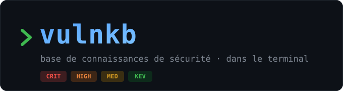

# vulnkb

<p align="center">
  
</p>

Base de connaissances de sécurité, **en local et en français**, consultable au
clavier dans le terminal. vulnkb collecte les vulnérabilités publiées par les
sources publiques (CISA KEV, OSV, CERT-FR, NVD, liste officielle des CVE,
exploits publics, EPSS), les
normalise dans un format commun, les stocke dans SQLite avec recherche
plein-texte (FTS5), et te permet de répondre en quelques frappes à des
questions comme :

- *« Mes dépendances ont-elles une faille critique exploitée ? »* → `mes exploitee`
- *« Qu'est-ce qui touche nginx et a un exploit public ? »* → `nginx exploit`
- *« Quelles failles risquent le plus d'être exploitées ce mois-ci ? »* → `epss:50`, tri par EPSS

Environ 390 000 entrées, une base d'environ 1,2 Go, aucune dépendance à un
service en ligne une fois la collecte faite.

## Fonctionnalités

**Collecte**
- 8 sources publiques : CISA KEV, OSV.dev (Go, PyPI, npm, Packagist, crates.io,
  Maven), CERT-FR en français, NVD (tous les CVE), la liste officielle des CVE
  avec l'enrichissement de la CISA (Vulnrichment), les exploits publics
  (Exploit-DB, Metasploit, PoC-in-GitHub) et les scores EPSS.
- CVE récents complétés dès leur publication : produits, versions, CWE et
  score de l'émetteur, sans attendre l'analyse de NVD, qui peut prendre des
  mois. En 2026, 90 % des CVE sans produit dans NVD en ont un grâce à cette
  source.
- Synchronisation incrémentale : après la première fois, seules les nouveautés
  sont téléchargées. Pas de doublons.
- Dédoublonnage entre sources : une faille décrite par plusieurs sources est
  fusionnée, et ses alias (CVE, GHSA, GO, PYSEC) restent cherchables.
- Enrichissement croisé : chaque entrée reçoit le score CVSS de NVD, le
  marqueur « exploitée » (KEV), les exploits publics, la probabilité EPSS,
  l'évaluation SSVC de la CISA et un renvoi vers l'avis CERT-FR.
- Ajout de tes propres articles ou notes : un LLM local (Ollama) les met au
  format de la base (`vulnkb add`).
- Sources perso ajoutables en un fichier Go.

**Recherche**
- Plein-texte instantané sur environ 390 000 entrées (SQLite FTS5) : par
  identifiant, produit, CWE, version ou mot-clé. Accents et casse sont
  ignorés.
- Filtres combinables :
  - sévérité (`sev:high+`) ;
  - source (`src:fr`) ;
  - faille exploitée (`exploitee`) ;
  - exploit public (`exploit`) ;
  - probabilité EPSS (`epss:10`) ;
  - tes produits (`mes`).
- 4 tris : pertinence, date, criticité, EPSS.

**Tes produits**
- Liste de surveillance (`mes`) : termes simples ou paquets exacts
  (`npm:express`).
- Import automatique des dépendances de tes projets : `package.json`,
  `go.mod`, `requirements.txt`, `pyproject.toml`, `composer.json`,
  `Cargo.toml`, `docker-compose`.
- Exposition par produit dans les statistiques.

**Interface terminal**
- Deux panneaux, liste et fiche, redimensionnables au clavier ou à la souris.
- Bloc « Que faire » en tête de fiche : priorité, action, lien de correctif.
- Scores CVSS et EPSS, évaluation de la CISA (SSVC), exploits publics,
  versions affectées et corrigées, CWE nommées en français.
- Blocs de code colorés et liens cliquables (OSC 8).
- Vue des sources (`Alt-S`), statistiques en barres (`Alt-I`), aide et
  glossaire des acronymes (`?`).
- 6 thèmes de couleurs. L'interface s'adapte aux fonds clair ou sombre et aux
  petits terminaux.
- Raccourcis `Alt` et `Ctrl` : ils marchent aussi dans VS Code.

**Rapports**
- Export HTML autonome d'une fiche (`Alt-E`) ou d'une recherche entière
  (`Alt-R`, `vulnkb export`), lisible hors ligne et imprimable.
- Statistiques en ligne de commande (`vulnkb stats`), aperçu de la base
  (`vulnkb info`), glossaire (`vulnkb glossaire`).

**Local et en français**
- Tout tient dans un fichier SQLite local, sans compte et sans service en
  ligne.
- LLM local via Ollama.
- Interface, fiches CERT-FR, glossaire et noms des CWE en français.

## Sommaire

- [Fonctionnalités](#fonctionnalités)
- [Installation](#installation)
- [Démarrage rapide](#démarrage-rapide)
- [Rechercher](#rechercher) — syntaxe, filtres, tris, exemples
- [L'interface (TUI)](#linterface-tui) — raccourcis clavier
- [Suivre tes produits (filtre `mes`)](#suivre-tes-produits-filtre-mes)
- [Statistiques](#statistiques)
- [Exporter en HTML](#exporter-en-html)
- [Ajouter un article ou un texte](#ajouter-un-article-ou-un-texte)
- [Sources](#sources) et [synchronisation](#synchroniser)
- [Toutes les commandes](#toutes-les-commandes)
- [Variables d'environnement](#variables-denvironnement)
- [Fichiers](#fichiers)
- [Architecture](#architecture)
- [Ajouter une source perso](#ajouter-une-source-perso)

Le guide détaillé (prérequis, dépannage, détail de chaque source) est dans
[INSTALL.md](INSTALL.md).

## Installation

Il faut **Go 1.25+** et un **compilateur C** (le stockage utilise
`github.com/mattn/go-sqlite3`, en cgo). Le tag `sqlite_fts5` est obligatoire :
il active la recherche plein-texte.

```sh
go mod tidy                                            # dépendances (une fois)
CGO_ENABLED=1 go build -tags sqlite_fts5 -o vulnkb .   # compile
cp vulnkb ~/.local/bin/                                # optionnel : l'avoir partout
CGO_ENABLED=1 go test -tags sqlite_fts5 ./...          # tests
```

## Démarrage rapide

```sh
vulnkb sync                          # 1re collecte : ~3 min, ~1,2 Go
vulnkb watch import ~/kuro_apps      # suivre les dépendances de tes projets
vulnkb                               # ouvrir l'interface
```

Dans l'interface, tape `mes sev:high+` : ce sont les failles graves qui
touchent tes projets. `?` affiche l'aide, `Esc` quitte.

## Rechercher

La même syntaxe sert partout : dans la barre de recherche de l'interface et
dans `vulnkb export`.

### Texte libre

La recherche porte sur l'identifiant (CVE, GHSA… et leurs alias), le titre, le
résumé, le composant, le type de faille (CWE), les versions et la
remédiation. Chaque mot est un **début de mot**, plusieurs mots se cumulent
(ET), casse et accents sont ignorés.

| Recherche | Trouve |
|-----------|--------|
| `CVE-2021-44228` | un CVE précis (Log4Shell), quelle que soit la source |
| `CVE-2026` | tous les CVE de 2026 |
| `GHSA-` | les avis GitHub |
| `log4j` | tout ce qui parle de log4j |
| `nginx` | le produit nginx (titre, composant, description) |
| `golang.org/x/net` | un module Go précis |
| `deserializ` | désérialisation, deserialize, deserialization… (début de mot) |
| `CWE-79` | les XSS (catégorie de faiblesse) |
| `RCE` | exécution de code à distance |
| `sql injection wordpress` | les trois mots à la fois |
| `1.27.1` | un numéro de version |
| `vtiger` | produits hors registres de paquets (via NVD et CERT-FR) |

### Filtres

Ils se combinent entre eux et avec le texte. Les filtres reconnus s'affichent
à droite de la saisie ; un filtre mal écrit apparaît en rouge.

| Filtre | Garde |
|--------|-------|
| `sev:crit` | sévérité critique (`crit`, `high`, `med`, `low`, `inconnue`, ou `critique`, `elevee`, `moyenne`, `faible`) |
| `sev:crit,high` | plusieurs sévérités |
| `sev:high+` | cette sévérité **ou plus grave** |
| `src:kev` | une source : `kev`, `osv`, `fr` (CERT-FR), `nvd`, `ia` (articles ajoutés) ; `src:kev,fr` pour plusieurs |
| `exploitee` | faille **exploitée activement** (CVE au catalogue CISA KEV) — priorité absolue |
| `exploit` | un **exploit ou une preuve de concept public** existe : référencé (Exploit-DB, Metasploit, GitHub) ou signalé par l'évaluation SSVC de la CISA |
| `epss:10` | probabilité d'exploitation EPSS **d'au moins 10 %** dans les 30 jours (`epss:1`, `epss:50`…) |
| `mes` | seulement **tes produits** (liste de surveillance, voir plus bas) |

`exploitee` veut dire que des attaques ont été observées pour de vrai, alors
qu'`exploit` veut dire seulement que du code public existe. Les deux
peuvent se cumuler.

### Tris

`Alt-O` (ou `Ctrl-O`) change l'ordre de la liste. En ligne de commande,
utilise `-tri`.

| Tri | Ordre | `-tri` |
|-----|-------|--------|
| **Pertinence** (défaut) | meilleure correspondance d'abord (score BM25 de l'index) ; sans texte : les plus récentes | `pertinence` |
| **Date** | publication la plus récente d'abord | `date` |
| **Criticité** | de critique à faible | `criticite` |
| **EPSS** | la plus susceptible d'être exploitée d'abord | `epss` |

### Exemples de recherches

**Prioriser tes correctifs**

```text
mes exploitee                 tes produits, failles exploitées activement → à corriger d'abord
mes sev:crit                  tes produits, sévérité critique
mes sev:high+ exploit         tes produits, grave, avec exploit public
mes epss:10                   tes produits, probabilité d'exploitation ≥ 10 % (trier par EPSS)
mes exploit                   tes produits pour lesquels un exploit circule
```

**Veille générale**

```text
exploitee                     tout le catalogue KEV (≈ 2 500 failles exploitées)
exploitee src:fr              les failles exploitées qui ont un avis CERT-FR, en français
epss:50                       les failles jugées les plus menacées
exploit sev:crit              critiques avec exploit public
exploitee exploit             exploitées ET avec exploit public
src:fr                        les avis CERT-FR (tri Date pour les derniers)
src:ia                        les articles que tu as ajoutés
```

**Un produit, une techno**

```text
nginx sev:high+               nginx, grave
nginx exploit                 nginx, avec exploit public
gitea sev:crit                gitea, critique
wordpress plugin CWE-89       injections SQL dans des plugins WordPress
openssl src:nvd               les fiches NVD d'openssl (masquées par défaut si doublon)
npm express                   express côté npm (synchroniser osv-npm d'abord)
pillow src:osv                les avis OSV de Pillow (PyPI)
```

**Par type de faille**

```text
CWE-79 sev:high+              XSS graves
CWE-502 exploit               désérialisation avec exploit public
SSRF exploitee                SSRF exploitées
path traversal sev:crit       traversée de répertoire critique
```

**En ligne de commande** (rapport HTML de la recherche)

```sh
vulnkb export mes sev:high+
vulnkb export -tri epss mes exploit
vulnkb export -tri date -o ~/veille-fr.html src:fr exploitee
```

## L'interface (TUI)

`vulnkb` (ou `vulnkb tui`) ouvre deux panneaux : à gauche la liste, à droite
la fiche.

Chaque ligne de la liste contient, dans l'ordre :

- un `●` rouge si la faille est exploitée ;
- la sévérité en couleur ;
- la source (`KEV`, `OSV`, `FR`, `NVD`, `IA`) ;
- l'identifiant et le titre ;
- le score EPSS, si la largeur le permet.

La fiche commence par un bloc **« Que faire »** : la priorité, l'action
concrète (version corrective, remédiation) et le lien le plus utile. Viennent
ensuite les scores (CVSS, EPSS), les exploits publics, les avis CERT-FR liés
et les références. Les liens sont cliquables.

| Touche | Action |
|--------|--------|
| *(taper)* | filtrer en direct |
| `↑` `↓` · `PgUp` `PgDn` · `Début` `Fin` | naviguer (liste ou fiche) |
| `Tab` | passer de la liste à la fiche |
| `Entrée` | fiche en plein écran |
| `Alt-G` | aller au résultat n° … |
| `Alt-T` | activer / couper le filtre `mes` |
| `Alt-O` | changer le tri : pertinence → date → criticité → EPSS |
| `Alt-S` | liste des sources (contenu, entrées, dernière collecte) |
| `Alt-I` | statistiques |
| `Alt-E` | exporter la fiche affichée en HTML |
| `Alt-R` | exporter tous les résultats en HTML |
| `Alt-Y` | changer le thème de couleurs |
| `Alt-←` `Alt-→` | redimensionner les panneaux (ou glisser la séparation à la souris) |
| `Alt-M` | rendre la souris au terminal (clic sur les liens, sélection) |
| `?` | aide : touches, couleurs, glossaire des acronymes |
| `Esc` · `Ctrl-C` | fermer / quitter |

Chaque raccourci `Alt` existe aussi en `Ctrl` (`Ctrl-O`, `Ctrl-T`…). Utilise
la version `Alt` quand le terminal garde le `Ctrl` pour lui : VS Code
intercepte par exemple `Ctrl-G`.

Thèmes : **bleu**, **rose**, **vert**, **cyan**, **violet**, **orange**. Pour
en choisir un : `vulnkb theme vert` ou `Alt-Y`. Le choix est mémorisé.

## Suivre tes produits (filtre `mes`)

La liste de surveillance est le fichier `~/.config/vulnkb/watch.txt`. Il
contient un terme par ligne, `#` sert aux commentaires, et il s'édite à la
main.

```sh
vulnkb watch                         # affiche la liste
vulnkb watch add nginx redis vtiger  # ajoute des produits
vulnkb watch add npm:axios pypi:fastapi   # ajoute des paquets exacts
vulnkb watch rm vtiger               # en retire
vulnkb watch import ~/kuro_apps      # ajoute les dépendances de tous tes projets
vulnkb watch import -n ~/kuro_apps   # simulation, sans rien modifier
```

Il y a deux sortes de termes :

- **simple** (`nginx`, `redis`, `vtiger`) : cherché en début de mot dans
  l'identifiant, le titre et le composant.
- **qualifié** (`npm:express`, `pypi:pillow`, `go:github.com/spf13/cobra`,
  `packagist:…`, `crates:…`) : seul ce paquet exact compte. Par exemple,
  `npm:react` ne ramène pas `@aws-amplify/codegen-ui-react`.

`watch import` lit les fichiers suivants : `package.json`, `go.mod`,
`requirements.txt`, `pyproject.toml`, `composer.json`, `Cargo.toml` et les
images `docker-compose`. Il ignore `node_modules`, les dossiers cachés et les
sauvegardes. Les dépendances de dev et les dépendances Go indirectes ne sont
ajoutées qu'avec `-dev` et `-indirect`.

Si tes projets utilisent npm, lance aussi `vulnkb sync osv-npm`, qui n'est pas
dans le sync par défaut.

## Statistiques

`Alt-I` dans l'interface, ou `vulnkb stats` :

- **vue d'ensemble** : entrées visibles et publiées ces 30 derniers jours ;
- **sévérités**, **menace** (exploitées, exploit public, EPSS ≥ 10 % et ≥ 50 %)
  et **années de publication**, en barres ;
- **sources** et **faiblesses les plus fréquentes** (CWE, avec leur nom) ;
- **ton exposition** : totaux pour ta liste de surveillance, et les produits
  les plus exposés (entrées critiques ou élevées, dont exploitées).

## Exporter en HTML

Une fiche ou une recherche entière s'exporte en un fichier HTML autonome :
lisible hors ligne, imprimable, en thème clair ou sombre selon le navigateur.

- Dans l'interface : `Alt-E` exporte la fiche affichée, `Alt-R` tous les
  résultats dans l'ordre du tri courant.
- En ligne de commande : `vulnkb export [-tri mode] [-max N] [-o fichier] <recherche…>`.

```sh
vulnkb export mes sev:high+                         # tes produits, grave
vulnkb export -tri epss mes epss:10                 # tes produits les plus menacés
vulnkb export -o ~/rapport.html exploitee src:fr    # fichier choisi
vulnkb export -max 50 -tri criticite nginx          # 50 fiches au plus
```

Le rapport s'ouvre sur des compteurs et un sommaire, puis donne chaque fiche
complète. Il contient 1 000 fiches au plus. Les fichiers vont dans
`~/vulnkb-exports/`, ou dans `VULNKB_EXPORT_DIR` si tu l'as défini. Le contenu
est échappé : un texte piégé ne peut rien exécuter.

## Ajouter un article ou un texte

`vulnkb add` transforme un document en fiche de la base, grâce à un LLM local
(Ollama). Tu peux lui donner le contenu de trois façons :

```sh
vulnkb add https://blog.example/write-up              # une page web (téléchargée)
vulnkb add ~/notes/faille-vtiger.md                   # un fichier : texte, Markdown ou HTML enregistré
xclip -o | vulnkb add -url https://origine.example -  # un texte envoyé par pipe
vulnkb add -                                          # colle le texte, puis Ctrl-D
```

**Le texte est mis au format de la base automatiquement.** Le modèle lit le
contenu et remplit une fiche :

- titre et résumé en français ;
- composant, type de faille et sévérité ;
- versions affectées et corrigées, remédiation ;
- identifiants CVE/GHSA.

La fiche est affichée, puis enregistrée seulement si tu confirmes (`-y` pour
ne pas demander). Elle apparaît ensuite avec la source `IA`, pour rappeler
qu'elle est à relire. Tu la retrouves avec `src:ia`.

- **Origine** : pour une page web, son URL sert de lien et d'identifiant. Pour
  un texte, indique-la avec `-url` si tu la connais. Sinon, l'identifiant est
  calculé à partir du contenu : réimporter le même texte met à jour la fiche
  au lieu de la dupliquer.
- **Garde-fous** : un CVE, un GHSA ou un numéro de version proposé par le
  modèle est retiré s'il n'apparaît pas dans le texte. Le résumé et la
  sévérité, eux, ne sont pas vérifiés : relis-les.
- **Réglages** : le modèle se choisit avec `-model` ou `VULNKB_MODEL` (défaut
  `qwen2.5-coder:7b`), l'adresse d'Ollama avec `-ollama` ou `OLLAMA_HOST`
  (défaut `http://localhost:11434`). Sans GPU, compte de 1 à 4 minutes selon
  la longueur du texte.

## Sources

| Source | Contenu | Par défaut |
|--------|---------|------------|
| `cisa-kev` | CVE activement exploitées (catalogue CISA KEV) | oui |
| `osv-go`, `osv-pypi`, `osv-packagist`, `osv-crates`, `osv-maven` | advisories OSV.dev par écosystème : versions affectées et corrigées, CWE, liens | oui |
| `osv-npm` | advisories OSV.dev npm (export de ~200 Mo) | non, `vulnkb sync osv-npm` |
| `certfr` | avis et alertes du CERT-FR (ANSSI), **en français** : systèmes affectés, risques, solution, CVE | oui |
| `nvd` | tous les CVE de la base NVD (NIST) : description, produits et versions (CPE), CWE, score CVSS. Les scores complètent la sévérité des autres sources ; un CVE déjà décrit ailleurs est masqué côté NVD (sauf `src:nvd`) | oui |
| `exploits` | exploits et PoC publics par CVE (Exploit-DB, Metasploit, GitHub), en métadonnées seulement : marqueur et filtre `exploit`, liens dans la fiche | oui |
| `epss` | probabilité EPSS (FIRST) qu'un CVE soit exploité dans les 30 jours, mise à jour chaque jour : ligne dans la fiche, filtre `epss:10`, tri par EPSS | oui |
| `cvelist` | liste officielle des CVE (CVE List V5) et enrichissement de la CISA (Vulnrichment) : complète les fiches NVD pas encore analysées (titre, produits, versions, CWE, score) et ajoute l'évaluation SSVC (ligne « Éval. CISA », filtre `exploit`) | oui |

`cvelist` télécharge l'export complet (~600 Mo, environ 45 s) la première
fois, puis seulement les deltas quotidiens (quelques secondes). Il ne crée pas
de fiches en double : il comble les trous des fiches NVD, et ce que NVD
fournit après son analyse reste prioritaire. Seuls les CVE incomplets côté
NVD sont gardés (~117 000, ~150 Mo de base en plus).

`certfr` couvre les 3 dernières années par défaut. `VULNKB_CERTFR_DAYS` règle
cette profondeur. Les synchros suivantes ne récupèrent que les bulletins
nouveaux ou révisés. Une entrée CISA ou OSV dont un CVE est couvert par un avis
CERT-FR affiche un renvoi vers cet avis.

Certaines entrées sont écartées ou fusionnées :

- les entrées OSV `MAL-*` (paquets malveillants) et les advisories retirés
  sont ignorés ;
- une même faille publiée sous plusieurs identifiants (GHSA, GO, PYSEC) n'est
  gardée qu'une fois, et ses alias restent cherchables.

`vulnkb sources` (ou `Alt-S`) liste les sources avec leur nombre d'entrées et
la date de leur dernière collecte.

### Synchroniser

La collecte est **manuelle** : lance `vulnkb sync` quand tu veux rafraîchir.
Après la première fois, un sync ne prend que quelques dizaines de secondes.

```sh
vulnkb sync                  # toutes les sources par défaut
vulnkb sync certfr epss      # seulement certaines sources
vulnkb sync osv-npm          # une source optionnelle
VULNKB_NVD_FULL=1 vulnkb sync nvd   # re-télécharger tout NVD
VULNKB_CVELIST_FULL=1 vulnkb sync cvelist   # re-télécharger toute la liste des CVE
```

Ce qu'un sync touche et ne touche pas :

- Les entrées collectées sont **mises à jour** à chaque sync : même
  identifiant, pas de doublon.
- Tes articles (`add`), ta liste de surveillance et ton thème ne sont **jamais
  modifiés** par un sync.

Pour automatiser, par exemple chaque matin à 7 h, ajoute cette ligne avec
`crontab -e` :

```cron
0 7 * * * $HOME/.local/bin/vulnkb sync >/dev/null 2>&1
```

L'en-tête de l'interface indique l'âge du dernier sync (« ● sync il y a 4 h »).

## Toutes les commandes

| Commande | Rôle |
|----------|------|
| `vulnkb` / `vulnkb tui` | interface de recherche |
| `vulnkb sync [source…]` | collecter (toutes les sources par défaut, ou celles nommées) |
| `vulnkb sources` | sources : contenu, entrées, dernière collecte |
| `vulnkb watch [add\|rm\|import] …` | gérer la liste de surveillance (filtre `mes`) |
| `vulnkb add [-y] [-url U] [-model M] <url\|fichier\|->` | ajouter un article ou un texte via Ollama |
| `vulnkb export [-tri T] [-max N] [-o F] <recherche…>` | rapport HTML d'une recherche |
| `vulnkb stats` | statistiques et exposition de tes produits |
| `vulnkb info` | aperçu : taille de la base, entrées par source, date EPSS |
| `vulnkb theme [nom]` | lister ou choisir le thème de couleurs |
| `vulnkb glossaire` | définitions en français des acronymes (CVE, CVSS, EPSS, CWE, RCE…) |

## Variables d'environnement

| Variable | Effet |
|----------|-------|
| `VULNKB_THEME` | force un thème pour une session (`VULNKB_THEME=vert vulnkb`) |
| `VULNKB_ACCENT` | remplace la couleur d'accent (`#d97757`) |
| `VULNKB_CODE_STYLE` | coloration des blocs de code (`monokai` par défaut, `github` pour fond clair, `dracula`, `nord`…) |
| `VULNKB_MOUSE` | `0` : ne pas capter la souris (liens cliquables sans `Alt-M`) |
| `VULNKB_EXPORT_DIR` | dossier des exports HTML (défaut `~/vulnkb-exports`) |
| `VULNKB_CERTFR_DAYS` | profondeur de collecte CERT-FR en jours (défaut 3 ans) |
| `VULNKB_NVD_FULL` | `1` : re-télécharger tous les flux NVD |
| `VULNKB_CVELIST_FULL` | `1` : re-télécharger l'export complet de la liste des CVE |
| `VULNKB_MODEL` | modèle Ollama pour `add` (défaut `qwen2.5-coder:7b`) |
| `OLLAMA_HOST` | adresse d'Ollama (défaut `http://localhost:11434`) |

## Fichiers

| Fichier | Contenu |
|---------|---------|
| `~/.config/vulnkb/vulnkb.db` | la base (ou le dossier courant si la config est inaccessible) ; la supprimer = repartir de zéro |
| `~/.config/vulnkb/watch.txt` | la liste de surveillance |
| `~/vulnkb-exports/` | les rapports HTML |

> Note réseau : la collecte contacte `cisa.gov`,
> `osv-vulnerabilities.storage.googleapis.com`, `www.cert.ssi.gouv.fr`,
> `nvd.nist.gov`, `epss.empiricalsecurity.com`, `api.github.com` et
> `github.com` (liste des CVE), `gitlab.com`,
> `raw.githubusercontent.com` et `codeload.github.com` (exploits), et
> `go mod tidy` récupère les modules. Si ton réseau filtre les sorties, autorise
> ces domaines, ou utilise `GOPROXY=direct` pour les dépendances.

## Architecture

```
internal/model/     format normalisé (Advisory) — le pivot commun
internal/store/     SQLite + index FTS5 : upsert, recherche, filtres, tris, statistiques
internal/source/    interface Source + registre ; une source = un fichier
internal/nvd/       scores et fiches NVD
internal/cvelist/   liste officielle des CVE (CVE List V5) et Vulnrichment de la CISA
internal/exploits/  références d'exploits publics (Exploit-DB, Metasploit, GitHub)
internal/epss/      scores EPSS (FIRST)
internal/manifest/  lecture des fichiers de dépendances (watch import)
internal/extract/   article ou texte → fiche via Ollama (commande add)
internal/glossary/  glossaire des acronymes (aide et commande glossaire)
internal/tui/       interface Bubble Tea + Lipgloss, statistiques, export HTML
main.go, watch.go   CLI
```

## Ajouter une source perso

Une source est un fichier Go dans `internal/source/` qui télécharge des
données et les convertit en fiches (`model.Advisory`). Elle s'enregistre
toute seule : une fois le binaire recompilé, elle apparaît dans
`vulnkb sources` et est collectée par `vulnkb sync`.

### 1. Écrire le fichier

Exemple complet : le flux RSS des bulletins de sécurité d'un éditeur, à
copier dans `internal/source/mon_flux.go` et à adapter (URL, nom, champs) :

```go
package source

import (
	"context"
	"encoding/xml"
	"fmt"
	"net/http"
	"regexp"
	"strings"
	"time"

	"vulnkb/internal/model"
)

// Flux RSS des bulletins de sécurité d'un éditeur (exemple).
const monFluxURL = "https://editeur.example/security/rss.xml"

func init() { Register(&monFlux{client: &http.Client{Timeout: 30 * time.Second}}) }

type monFlux struct{ client *http.Client }

func (s *monFlux) Name() string { return "mon-flux" }

func (s *monFlux) Fetch(ctx context.Context, since time.Time) ([]model.Advisory, error) {
	req, err := http.NewRequestWithContext(ctx, http.MethodGet, monFluxURL, nil)
	if err != nil {
		return nil, err
	}
	resp, err := s.client.Do(req)
	if err != nil {
		return nil, err
	}
	defer resp.Body.Close()
	if resp.StatusCode != http.StatusOK {
		return nil, fmt.Errorf("statut %d", resp.StatusCode)
	}

	var feed struct {
		Items []struct {
			Title       string `xml:"title"`
			Link        string `xml:"link"`
			Description string `xml:"description"`
			PubDate     string `xml:"pubDate"`
			GUID        string `xml:"guid"`
		} `xml:"channel>item"`
	}
	if err := xml.NewDecoder(resp.Body).Decode(&feed); err != nil {
		return nil, err
	}

	cveRe := regexp.MustCompile(`CVE-\d{4}-\d{4,}`)
	var out []model.Advisory
	for _, it := range feed.Items {
		pub, _ := time.Parse(time.RFC1123Z, it.PubDate)
		id := it.GUID
		if id == "" {
			id = it.Link
		}
		ext := id
		if cves := cveRe.FindAllString(it.Title+" "+it.Description, -1); len(cves) > 0 {
			ext = id + " (" + strings.Join(cves, ", ") + ")"
		}
		out = append(out, model.Advisory{
			ID:         s.Name() + ":" + id,
			Source:     s.Name(),
			ExternalID: ext,
			Title:      it.Title,
			Summary:    it.Description,
			References: []string{it.Link},
			Published:  pub,
			URL:        it.Link,
		})
	}
	return out, nil
}
```

### 2. Remplir la fiche

| Champ | Rôle | Conseil |
|-------|------|---------|
| `ID` | identifiant interne unique et stable | `"<source>:<id d'origine>"` : une nouvelle synchro met la fiche à jour au lieu de la dupliquer |
| `Source` | nom de la source | le même que `Name()` |
| `ExternalID` | identifiant affiché, et ses alias | mets les CVE entre parenthèses : `"BULL-42 (CVE-2026-1234, CVE-2026-5678)"`. C'est ce qui relie la fiche au reste de la base : marqueur « exploitée » (KEV), score NVD, exploits publics, avis CERT-FR, filtre `exploitee` |
| `Title`, `Summary` | titre et description | le résumé peut contenir du Markdown et des blocs de code, ils seront mis en forme |
| `Component` | produit ou paquet touché | c'est ce que cherche le filtre `mes` (liste de surveillance) |
| `Severity` | sévérité | `CRITICAL`, `HIGH`, `MODERATE`/`MEDIUM`, `LOW`, ou un vecteur CVSS 3.x (le score est calculé). Vide : la sévérité NVD des CVE prend le relais |
| `VulnType` | type de faille | codes CWE (`CWE-79`) : leur nom s'affiche en français |
| `AffectedVersions`, `FixedVersions` | versions touchées / corrigées | alimentent le bloc « Que faire » |
| `Remediation` | action recommandée | idem |
| `References`, `URL` | liens | le lien de correctif le plus utile est repris dans « Que faire » |
| `Published` | date de publication | sert au tri par date |

### 3. Options

- `Optional() bool` renvoyant `true` : la source n'est collectée que si on la
  nomme (`vulnkb sync mon-flux`), utile pour une source lourde (voir `osv.go`).
- `Incremental() bool` : le sync lui passe la date de sa dernière collecte
  (`since`) pour ne récupérer que les nouveautés.
- `FetchKnown(ctx, known)` : variante qui reçoit la date de collecte de chaque
  fiche déjà en base, pour ne télécharger que le nouveau ou le révisé
  (voir `certfr.go`).
- Badge et filtre : ajoute ta source à la table `sources` de
  `internal/tui/present.go` (badge de 3 lettres, couleur, nom) et à `srcNames`
  dans `internal/store/query.go` (pour `src:mon-flux`). Sans cela, le badge
  prend les 3 premières lettres du nom, en gris.

### 4. Tester et collecter

```sh
CGO_ENABLED=1 go build -tags sqlite_fts5 -o vulnkb .
./vulnkb sources            # la source apparaît
./vulnkb sync mon-flux      # collecte seulement celle-ci
./vulnkb info               # nombre d'entrées par source
```

Pour un test automatique sans réseau, sers un faux flux avec `httptest`
(voir `certfr_test.go`).

Un document isolé (un write-up, une note) n'a pas besoin de source : utilise
`vulnkb add`.
